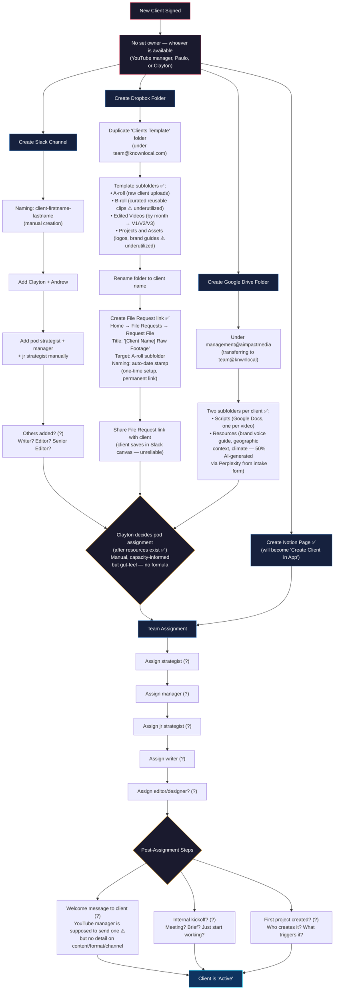

# Client Onboarding — As-Is Process Map

> **Purpose:** Document the current manual onboarding process so we can identify improvements.
> **Status:** Updated 2026-04-06 with findings from two discovery calls (Clayton+Paulo+Nourin, Paulo+Nourin).
> **Gaps marked with:** (?) = unknown/needs confirmation | ✅ = confirmed | ⚠️ = partially confirmed

## Process Map



## Key Structural Finding

**Pod assignment happens AFTER resource creation, not before.** The original map showed pod assignment driving everything downstream. In reality, Slack channels, Dropbox folders, GDrive folders, and Notion pages can all be created independently. Pod assignment only matters for team member assignment.

> Clayton (15:25): "Not really. All the stuff that can be created is independent, and then we assign it to the pod afterwards, basically."

This simplifies automation — resource creation can be fully automated without waiting for Clayton's pod decision.

## Known Pain Points

| # | Pain Point | Source | Severity |
|---|-----------|--------|----------|
| P1 | **No single owner for onboarding** — "a YouTube manager or Paulo or someone on the team randomly does it." No set person, no set process. | Clayton, Paulo (Call 1) | High |
| P2 | **Onboarding steps can be missed with no detection** — no structured checklist or verification. "We don't have it like down to like a super, super process thing at the moment." | Clayton (Call 1) | High |
| P3 | **Account/tool fragmentation** — Dropbox on one email, GDrive on another, different access methods. "It's just a little annoying." | Clayton (Call 1) | High |
| P4 | **Dual file system (Dropbox + GDrive) creates confusion** — some assets in Dropbox, some in GDrive, no clear rule about what goes where. | Paulo (Call 2) | Med |
| P5 | **B-roll folder is disorganized and underutilized** — intended as curated library organized by type (drone, landmarks), but editors dump files with inconsistent naming. "This is not working like it should." | Paulo (Call 2) | Med |
| P6 | **Projects and Assets folder largely empty/broken** — most clients still use GDrive for brand assets. "We rarely use this folder." | Paulo (Call 2) | Med |
| P7 | **Client upload link discovery is unclear** — after initial File Request link is shared, clients re-find it via Slack canvas (maybe). Paulo: "I could be wrong." | Paulo (Call 2) | Med |
| P8 | **GDrive downloading fails for large folders** — splits into 2GB zips, individual zips fail mid-download for projects >10 GB. | Paulo (Call 2) | High |
| P9 | **Storage pressure** — Dropbox at 24/30 TB. Avg project ~10 GB (range 5-30 GB). ~74 active clients. | Clayton (Call 1), Paulo (Call 2) | Med |
| P10 | **Notion KPI dashboards painful to build** — relational database limitations. Videos launched showing 0% (data integrity). Strategists not logging calls (0% two months running). | Paulo, Clayton (Call 1) | Med |
| P11 | **Pod capacity is misleading for new pods** — Pod 4 has lowest numbers but just onboarded 6 clients. Raw numbers don't reflect true capacity. | Clayton (Call 1) | Med |
| P12 | **Brand asset creation is nascent** — Clayton just starting to build visual brand identity for all clients. Most clients lack proper brand assets in file system. | Paulo (Call 2) | Low |
| P13 | **Scripting Writer field often empty in Notion** — data hygiene issues. "This should not be empty, but okay." | Paulo (Call 2) | Low |

## Production Workflow (Post-Onboarding Reference)

Confirmed from Call 2. Not part of onboarding, but connects to Module 2 Kanban design.

```
Writer writes script → pastes Google Doc link in Notion task (triggers KPI timestamp)
    ↓
Strategist assigns topic/title, sets due dates
    ↓
Client films footage → uploads via Dropbox File Request link to A-roll
    ↓
Editor edits video (V1) → uploads to Dropbox Edited Videos/[Month]/[Video]
Editor submits via Notion "Edit Submission" form (pastes task link, selects version)
    ↓
Notion automation → Slack message tags Senior Editor + YouTube Manager
    ↓
Senior Editor reviews V1 → approves or requests changes (replies in Slack thread)
    ↓
YouTube Manager sends V2 link to client (NOT the editor)
    ↓
Client reviews on Dropbox (timestamped, pinpoint comments — both internal & client)
    ↓
If changes requested → Editor produces V3 → re-submits via Notion
    ↓
YouTube Manager does final review → publishes to YouTube
```

**Version convention:** V1 = internal review, V2 = client review (sometimes V1 goes directly to client if "perfect"), V3 = final/published. Not every video needs all 3 versions.

## Discovery Gap Tracker

### Answered (8 of 26)

| # | Question | Answer | Source |
|---|----------|--------|--------|
| 3 | How is pod assignment decided? | Clayton decides manually, capacity-informed but gut-feel. No formula. | Call 1 |
| 4 | Capacity check or gut feel? | Gut feel with visible numbers. Pod 4 has lowest count but just started — context matters. | Call 1 |
| 9 | Dropbox template subfolders? | A-roll, B-roll, Edited Videos, Projects and Assets. Confirmed via screen share. | Call 1 + 2 |
| 10 | Post-duplication steps? | File Request link created (one-time, permanent). Auto-date stamp on uploads. | Call 1 + 2 |
| 12 | What goes in GDrive? | Scripts (Google Docs) AND Resources (brand voice guide, geographic context, climate, writing guidelines — 50% AI via Perplexity). | Call 2 |
| 13 | GDrive subfolder structure? | Two subfolders: Scripts, Resources. | Call 2 |
| 14 | Eliminating GDrive feasible? | Paulo is open. Dropbox has Google Docs integration (Paulo didn't know). Writing team not consulted yet. | Call 2 |
| 21 | Other hidden steps? | Brand guidelines: client fills form → Perplexity AI deep research → client approval. Clayton building visual brand identity for all clients (in progress). | Call 2 |

### Partially Answered (3 of 26)

| # | Question | What We Know | What's Missing |
|---|----------|-------------|----------------|
| 6 | Who else gets added to Slack? | Edit workflow sends Slack notifications tagging senior editor + YouTube manager (implies they're in channels). | Explicit channel membership list for onboarding |
| 11 | Dropbox 24/30 TB — plan? | File sizes clarified (avg 10 GB, range 5-30 GB). No strategic answer on the plan. | Archival policy, upgrade plan |
| 18 | Welcome message to client? | Clayton listed "send a welcome message, invite the client" as a YT manager responsibility. | Content, format, channel unknown |

### Still Open (15 of 26)

| # | Question | Priority | Best Respondent |
|---|----------|----------|-----------------|
| 1 | What's the literal trigger after a client signs? | **Critical** | Paulo + Clayton |
| 2 | Where is client info entered first? | **Critical** | Paulo |
| 5 | Has a pod assignment ever been wrong or changed? | Med | Clayton |
| 7 | Has anyone ever been missed from a Slack channel? | Med | Paulo |
| 8 | When a team member changes, who updates Slack? | Med | Paulo |
| 15 | How does each team member find out about new assignments? | **Critical** | Paulo |
| 16 | Is there a specific order to team assignments? | Med | Paulo |
| 17 | Who assigns writer/editor/designer? | **Critical** | Paulo + Clayton |
| 19 | Internal kickoff meeting or brief? | Med | Paulo |
| 20 | When/how is the first project created? | **Critical** | Paulo |
| 22 | Most annoying part of onboarding? | Med | Both |
| 23 | How often does something go wrong? | Med | Both |
| 24 | Top 3 things to automate? | Med | Both |
| 25 | What must stay manual? | Med | Both |
| 26 | How many clients onboarded per month? | Med | Paulo |

**Next step:** Schedule a focused 30-min follow-up with Clayton + Paulo to cover the 5 critical gaps (1, 2, 15, 17, 20) — these block automation design.
