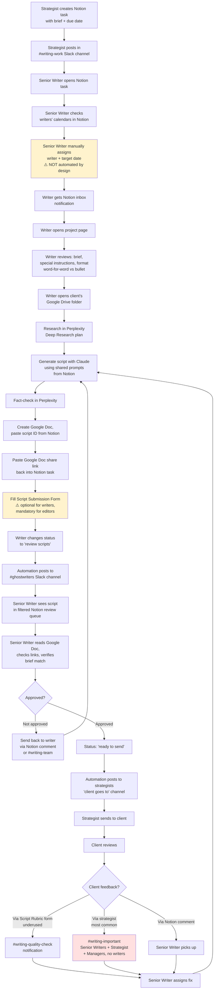

# Writer Process — As-Is Process Map

> **Purpose:** Document the current script writing and review workflow so we can design the app to match reality.
> **Status:** Created 2026-04-14 from two discovery calls:
> - Session 1: Paulo + Vivian (Senior Writer) + Rafael (Senior Writer) + Jessica (Writer, observed)
> - Session 2: Paulo + Jessica (Writer) + Vivian + Rafael (observed)
> **Gaps marked with:** (?) = unknown/needs confirmation | ✅ = confirmed | ⚠️ = noted pain point

---

## Process Map

---

## Step-by-Step Table

| # | Step | Who | Where | Notes |
|---|------|-----|-------|-------|
| 1 | Create script task with brief + due date | Strategist | Notion | Brief can be pasted directly or linked |
| 2 | Announce available work | Strategist | Slack `#writing-work` | Posts link to Notion task |
| 3 | Review task + due date | Senior Writer | Notion | Usually Vivian or Rafael |
| 4 | Check writer availability | Senior Writer | Notion writer pages (calendar view) | Manual capacity check across 6 writers |
| 5 | Assign writer + set date | Senior Writer | Notion | ⚠️ **They explicitly do NOT want this automated** — need flexibility to rebalance urgent scripts |
| 6 | Receive notification | Writer | Notion inbox | Mentioned on task |
| 7 | Open project, read brief | Writer | Notion | Check: full video outline, hook, sections, special instructions, format (word-for-word vs bullet) |
| 8 | Access client resources | Writer | Google Drive → Client folder | Subfolders: `scripts/` (used ✅), `resources/` (brand voice, area guide), `content/` (supporting material like PDFs), `thumbs/` (not used by writers) |
| 9 | Research topic | Writer | Perplexity (Deep Research) | Uses shared prompts from Notion |
| 10 | Generate script draft | Writer | Claude | Uses shared prompts from Notion "Script Writing Prompts" page |
| 11 | Fact-check | Writer | Perplexity | Verify data, rewrite sections as needed |
| 12 | Create Google Doc | Writer | Google Drive → client `scripts/` folder | Must include Notion task ID in doc |
| 13 | Link doc in Notion | Writer | Notion task | Paste share link (editor access) + delivery date |
| 14 | Fill Script Submission Form | Writer | Notion form | ⚠️ Optional for writers (quality checklist), mandatory for video editors |
| 15 | Mark "review scripts" | Writer | Notion status field | Triggers Slack automation |
| 16 | Ghostwriters channel notification | System | Slack `#ghostwriters` | Most important channel — all status automations post here |
| 17 | See in review queue | Senior Writer | Notion (filtered by status + due date) | "1 day remaining" countdown shown |
| 18 | Review script | Senior Writer | Google Doc | Read through, check links, verify brief match. No AI-assist used — full manual read |
| 19 | Change status | Senior Writer | Notion | Either `ready to send` (approved) or back to writer (not approved) |
| 20 | Notify strategist | System | Slack "client goes to" channel | Automated from Notion status |
| 21 | Send to client | Strategist | Client-specific Slack channel | Outside writer's visibility |
| 22 | Client reviews | Client | Usually Google Doc | 1–3 day lag typical, time-zone sensitive |
| 23 | Client feedback loop | Varies | 3 possible paths | See feedback routing below |

---

## App & Tool Inventory

| Tool | Used For | Frequency |
|------|----------|-----------|
| **Notion** | Task tracking, calendars, briefs, shared prompts, status, comments | All day, every day |
| **Slack** | Assignment, notifications, async comms, feedback loops | All day |
| **Google Drive** | Client resources, brand voice guides, area guides | Per script |
| **Google Docs** | The actual script document | Per script |
| **Perplexity** (Deep Research plan) | Research + fact-checking | Per script |
| **Claude** | Script generation using shared prompts | Per script |
| **Fathom** | Meeting recording/transcripts | Ad-hoc |

**Not used by writers:** The `content/` and `thumbs/` folders in client Google Drive are for editors/designers, not writers (writers only access `scripts/` and `resources/`).

---

## Slack Channel Map

Complete inventory of writing-adjacent Slack channels, with members and purpose. Several are redundant or underused — flagged for consolidation.

| Channel | Members | Purpose | Status |
|---------|---------|---------|--------|
| `#writing-work` | Strategists, YouTube Managers, Writers, Senior Writers | Strategists post new script assignments | ✅ Core channel |
| `#writing-brief` | Strategists, Managers, Senior Writers (no writers) | Writers ask strategist about brief details | ⚠️ Rafael suggests merging with `#writing-work` — redundant |
| `#writing-important` | Strategists, Managers, Senior Writers (NO writers) | Client feedback on completed scripts routed here | ✅ Core — but writers are not in it |
| `#ghostwriters` | Senior Writers + Writers | Receives ALL Notion status automations (ready to review, ready to send, done) | ✅ Most important — "probably the most important channel we have" |
| `#writing-quality-check` | (unclear) | Receives Writer Submission Form + Client Script Rubric form notifications | ⚠️ Client rubric form is underused — most clients still go through strategist |
| `#senior-writers-room` | Senior Writers + Clayton + Andrew + Paulo | Ops questions, Notion help, issues about writers (can't discuss writers in front of them) | ✅ Active |
| `#writers-room` | 6 Writers + 2 Senior Writers (no leadership) | Peer help, async questions writers feel uncomfortable raising with leadership | ⚠️ Used less and less — Rafael: "don't need this when we move to the app" |
| `#writing-team` | Writers + Senior Writers + Andrew + Clayton | Brainstorming specific scripts, feedback to writers, prompt updates | ✅ Used more than Writers Room now |
| `#writing-training` | Clayton, Andrew, Vivian, Rafael | Hiring new writers | ⏸️ Not active — hiring paused until ~June 2026 |
| `#hiring-ghostwriter` | Vivian, Andrew, Blythe, Clayton, Joy (assistant) | Receives CVs/portfolios from Gmail | ⏸️ Not active — automation pending |
| Client-specific `#client-<name>` | Strategist + client | Strategist ↔ client comms | Outside writer visibility |
| Daily Reports channel (name unclear) | Everyone | Weekly Monday status reports | ⚠️ Team complains these are redundant — asked if still needed |
| Onboarding channel | Broad | New client arrival notifications | ✅ Active |

### Channel consolidation opportunities (for V1 app design)

1. **Merge `#writing-brief` + `#writing-work`** — Rafael's explicit suggestion. All work-related questions in one place.
2. **Retire `#writers-room`** — writers now use `#writing-team` (which has leadership). Rafael: "we don't need this when we move to the app."
3. **Make client feedback visible to writers** — `#writing-important` deliberately excludes writers, but they are the ones fixing the feedback. This creates an extra hop through senior writers.
4. **Daily reports** — team is actively asking whether they are still needed. Worth confirming with Clayton.

---

## Notion Page Inventory

| Page | Used By | Purpose |
|------|---------|---------|
| Script project page (per script) | All | Main unit of work — brief, status, writer, due date, links, notes |
| Writer individual pages | Senior Writers | Calendar view of assigned scripts per writer (capacity planning + KPI tracking) |
| Senior Writer review pages (Vivian's, Rafael's) | Senior Writers | Filtered review queue — only scripts with status = "reviewing" or "review script fixes" |
| **Script Writing Prompts** | All writers | Shared library of tested prompts: brand voice, writing, review, hooks, CTAs — "a dictionary for prompts" |
| Writing Projects | Senior Writers | Side projects (e.g., hiring process, prompt iteration, spreadsheet planning) |
| Onboarding page | All | New client info |
| Client resource pages | Writers | Brand voice, area guide (also linked from Google Drive) |

**Key observation:** The Script Writing Prompts page is a critical asset — "most writers use these, it's already a workflow." The app must preserve access to this shared prompt library or replicate it.

---

## Feedback Routing (3 paths, by frequency)

When a client has feedback on a sent script, it arrives via one of three paths:

1. **Via Strategist → `#writing-important`** (most common) — Client messages strategist in their private channel, strategist reposts in `#writing-important`. Senior writer picks up, assigns fix to writer.
2. **Via Script Rubric form → `#writing-quality-check`** (underused) — Strategists actively incentivize clients to use this, but adoption is low.
3. **Via Notion comment on the task** — Some clients leave direct comments. Not all clients do this.

**Jessica's workflow nuance:** Writers leave comments in Notion's notes/comments field to communicate with the strategist about details they don't want in the script itself (e.g., "title doesn't match data"). She prefers this over Slack because it goes straight to the strategist's Notion inbox without demanding immediate attention.

---

## Pain Points (flagged during sessions)

| # | Pain | Severity | Source |
|---|------|----------|--------|
| 1 | Communication lag with clients — writers can't talk directly, must go through strategist | High | Rafael |
| 2 | Time-zone delays compound the lag — writer waiting on strategist waiting on client | High | Rafael (Gabi example, new client) |
| 3 | Redundant Slack channels (`#writing-brief` vs `#writing-work`) | Medium | Rafael |
| 4 | Daily reports feel redundant | Medium | Team chatter during session 2 |
| 5 | Script Rubric feedback form is underused — clients still prefer strategist route | Medium | Vivian |
| 6 | Writer Submission Form is optional for writers — underused | Low | Rafael ("recommended, not mandatory") |
| 7 | "Writers Room" channel fading in usage | Low | Rafael (already wants to retire it) |
| 8 | No shared convention for writer-to-strategist async clarifications — Jessica uses Notion comments, others may use Slack or skip | Medium | Jessica: *"I think I'm the only one who leaves comments. I don't know."* |
| 9 | Script format field (word-for-word vs bullet) is buried in the Notion page — easy to miss, but fundamentally changes the writing approach | Medium | Jessica |

---

## Workload Snapshot (per senior writer)

- **Rafael reviews ~30–40 scripts per week** (~120–160/month)
- **"Some weeks, 50+"**
- Active at any moment: **~12 scripts** in the overview queue, "cleaned" in one sitting
- Board fit: *"This works really, really well. We can visualize what we need to do. It's all good."* — Rafael

**Implication for the app:** The senior writer's board needs to handle high-velocity, short-cycle items with strong filtering (by status + due date) and a countdown ("1 day remaining" style) that currently exists in Notion.

---

## Explicit Constraints on App Design

From the sessions, these are constraints the app must respect:

1. **Do NOT auto-assign writers.** Senior writers explicitly rebalance across writers based on urgency and individual load. Automation would remove the flexibility they rely on for urgent scripts. *(Vivian: "being automated, I don't think it's going to work because of that")*
2. **Preserve the shared prompt library** in some form — writers reference it constantly.
3. **Keep Word/Google Doc links external** — the team expects to keep writing in Google Docs, the app tracks the link, not the content.
4. **Status-driven Slack notifications are load-bearing** — `#ghostwriters` automations are how senior writers know a script is ready to review. The app must replicate this or provide equivalent signal.
5. **Writers currently have no visibility into client feedback** by Slack channel design — the app is a chance to fix this gap *if* leadership agrees.

---

## Questions for Clayton / Paulo

- Q1: Who exactly is in `#writing-quality-check`? (unclear from transcript)
- Q2: Is the "daily report" still required? Team is actively questioning it.
- Q3: Should writers gain direct visibility to client feedback, or maintain current senior-writer buffer?
- Q4: Should auto-assignment be an *option* for non-urgent scripts, or completely off the table?
- Q5: What is the "client goes to" channel's exact name? (referenced but not shown)
- Q6: Does Clayton want the Script Writing Prompts page replicated in the app or kept in Notion?

---

## App Implications (for My Board, brief)

Based on this map, the senior writer's My Board should:

- ✅ Show a filtered review queue by status (reviewing, review fixes) and due date countdown
- ✅ Link directly to the Google Doc (external)
- ✅ Show which writer is assigned + allow reassignment in-place
- ✅ Show brief + special instructions + format (word-for-word vs bullet) on the card without drilling in
- ✅ Manual drag-to-assign writer (no auto-assign)
- ✅ Card count per column, high-density list view

The writer's My Board should:

- ✅ Show assigned scripts with due date
- ✅ Prominent links: Brief, Client Google Drive, Brand Voice, Area Guide, Script Writing Prompts
- ✅ Submission Form integration (lowered friction vs current flow)
- ✅ Comments field (replacing the Notion notes pattern Jessica uses)
- ✅ Status transition to "review scripts" = one-click action
